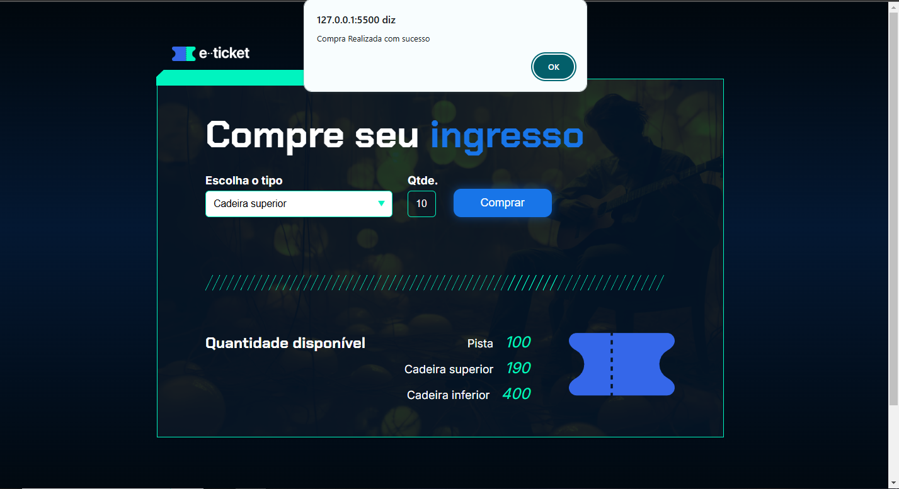

# Projeto Comprar Ingresso
## Seguindo os aprendizados de Backend em Javascript com a Alura

<h2>TECNOLOGIAS USADAS</h2>
<table style="border-collapse: collapse; margin: 0 auto;">
    <tr>
        <td style="border: none; text-align: center;">
            
        </td>
        <td style="border: none; text-align: center;">
            
        </td>
        <td style="border: none; text-align: center;">
            
        </td>
    </tr>
</table>

### O intuito do projeto foi criar um site onde podemos comprar ingressos variando as opções de assento e quantidades
## Primeiro projeto realizado por conta própria sem cópia ou acompanhamento do curso

## Print da tela com o site funcional

### O projeto pode ser testado no link: https://ingresso-vert.vercel.app/
